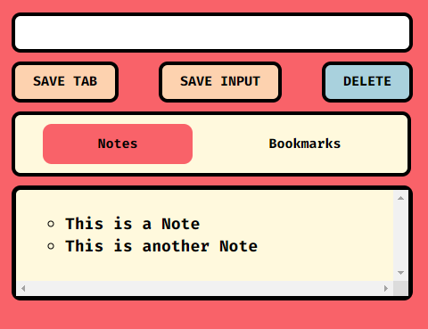

# Razor Notes Chrome Extension


Razor Notes is a Chrome extension that allows you to store notes and bookmark tabs , helping you stay organized while browsing.

## Features

- Create and manage notes: Easily jot down important information, reminders, or ideas while browsing the web.
- Bookmark tabs: Save and organize your favorite websites for quick access.
- Separate storage: Keep your notes and bookmarks independent of each other for better organization.

## Installation

1. Clone or download the repository to your local machine.

    ``` 
    https://github.com/Armaan-268/Notes_Extension
    ```

2. Open Google Chrome and navigate to chrome://extensions.

3. Enable the "Developer mode" toggle switch located in the top-right corner of the extensions page.

4. Click on the "Load unpacked" button and select the directory where you cloned or downloaded the repository.

5. The Razor Notes extension should now be installed and visible in your browser's toolbar.

## Usage
Click on the Razor Notes icon in the toolbar to open the extension popup.

To add a note, enter your text in the input field, and click "Save Input".

To bookmark a tab, click on the "Save Tab" button. The current tab will be saved as a bookmark.

To view and manage your notes and bookmarks, click on the corresponding buttons in the extension popup.

## Screenshots


## Contributing
Contributions are welcome! If you have any suggestions, bug reports, or feature requests, please open an issue or submit a pull request.
